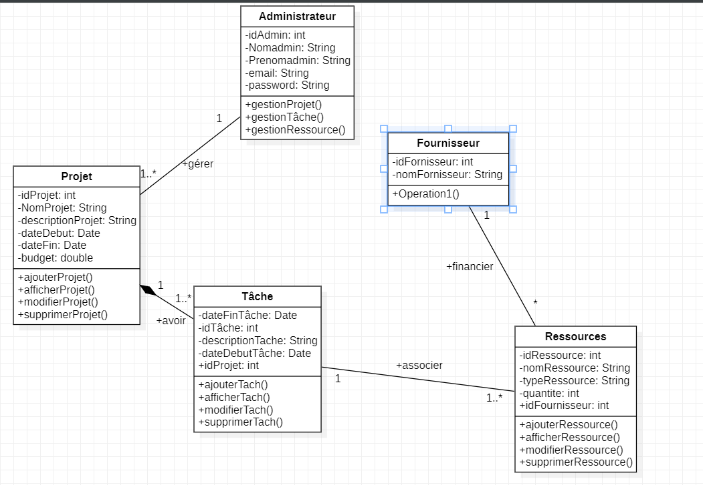
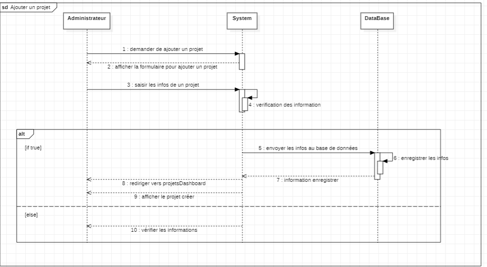

📌 **Description du projet**
ConstructionXpert est une application web conçue pour aider les équipes de construction à planifier, gérer et suivre leurs projets. Elle permet aux administrateurs de créer des projets, d’assigner des tâches, de gérer les ressources et de suivre l'avancement des travaux.

L'objectif principal est de fournir un outil intuitif et efficace pour organiser les projets de construction et améliorer la productivité.

🚀 Fonctionnalités principales
🔹 Gestion des Projets

✅ Créer un nouveau projet avec son nom, sa description, ses dates et son budget.

✅ Afficher la liste des projets existants avec leurs détails.

✅ Modifier les informations d'un projet.

✅ Supprimer un projet.

🔹 Gestion des Tâches

✅ Ajouter des tâches à un projet avec une description, des dates et des ressources associées.

✅ Lister les tâches d'un projet spécifique.

✅ Modifier les détails d'une tâche existante.

✅ Supprimer une tâche.

🔹 Gestion des Ressources

✅ Ajouter de nouvelles ressources avec leur type, quantité et fournisseur.

✅ Afficher toutes les ressources disponibles.

✅ Modifier ou supprimer une ressource existante.

✅ Mettre à jour la quantité après chaque assignation à une tâche.

🛠️ Technologies utilisées

Backend : Java EE (Servlets, JSP, JDBC)

Base de données : MySQL

Frontend : HTML, CSS (Bootstrap), JavaScript

Serveur d'application : Apache Tomcat

